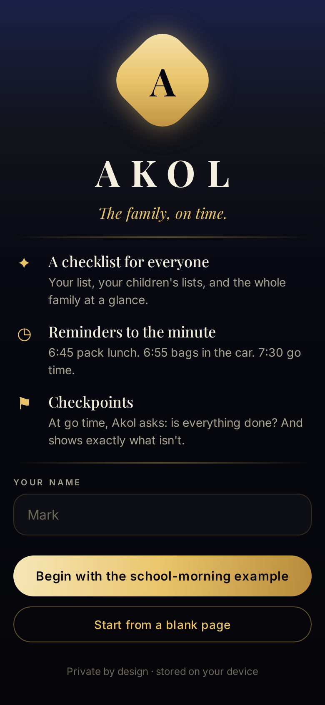
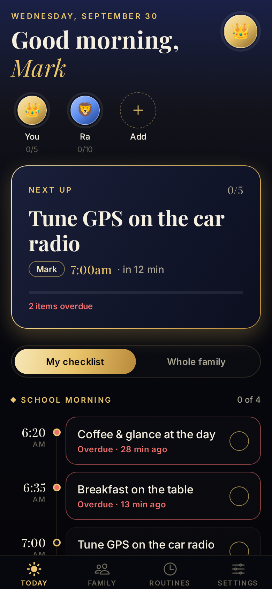
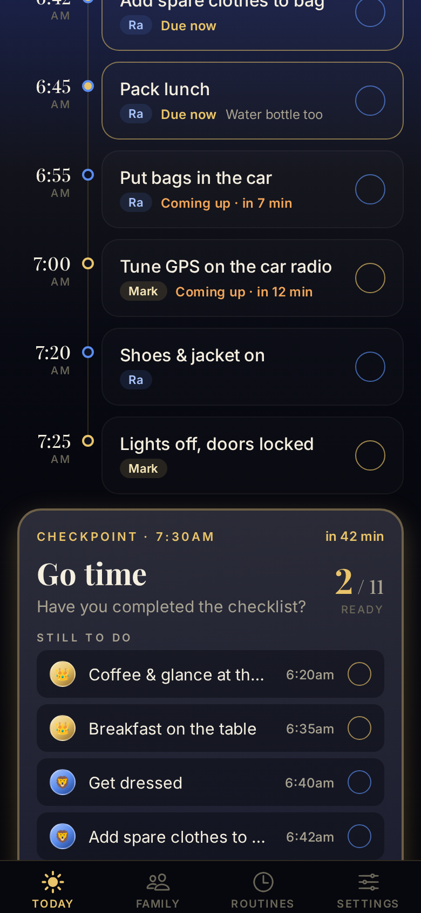
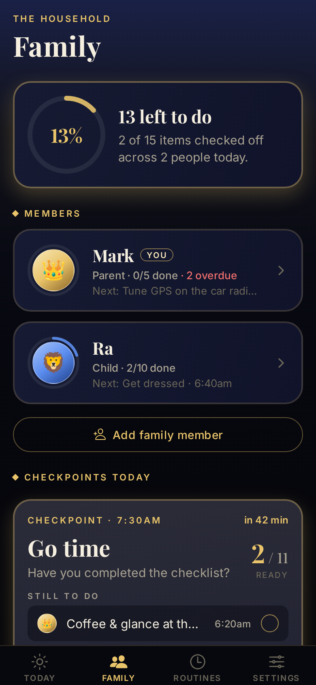
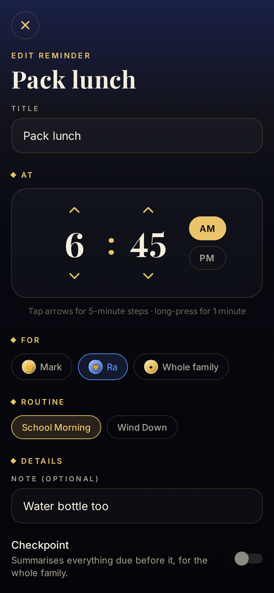

# Akol — the family, on time

A timed family checklist for iOS, Android and the web. Every item has a time: 6:45 pack lunch, 6:55 bags in the car,
7:00 tune the GPS. At a **checkpoint** such as *7:30 Go time* Akol asks: *have you completed the checklist?* It then
shows everyone's open items.

- **My checklist**: the device owner's own list (for example Mark, the dad).
- **Whole family**: every member's items on one timeline, with a colour for each person.
- **Checkpoints**: gather everything due before them across the family. You can tick items there or mark them all done.
- **Timed reminders**: local notifications fire at the exact minute. Each one has a **Mark done ✓** button, and Akol
  skips the reminder if the item is already ticked.
- **Streaks, progress rings and "next up"**: a countdown to the next item and a warning when something is overdue.
- **Private by design**: data stays on the device. There is no account and no server, so it costs nothing to run.

<p>
  
  
  
  
  
</p>

## Tech (chosen to keep costs low for a solo founder)

| Concern | Choice | Why |
| --- | --- | --- |
| App framework | **Expo SDK 57 / React Native**, TypeScript | One codebase for iOS, Android and web |
| Navigation | Expo Router (`src/app/`) | File-based routes, deep links (`akol://`) |
| Reminders | `expo-notifications` local notifications | Works offline with no push server |
| Storage | AsyncStorage (localStorage on web) | Needs no backend |
| Builds and store submission | EAS Build / Submit | No Mac needed for iOS builds |

### Project layout

```
src/
  app/                 screens (Expo Router)
    (tabs)/            Today · Family · Routines · Settings
    member/[id].tsx    one person's day
    routine/[id].tsx   edit a routine: days, timeline, checkpoints
    task.tsx           add/edit a reminder (modal)
    member-edit.tsx    add/edit a family member (modal)
    welcome.tsx        first-run onboarding
  components/          design system (gilt cards, jewel avatars, rings, time picker, timeline)
  lib/
    schedule.ts        pure scheduling logic (unit-tested)
    notifications.ts   rolling-window reminder scheduler
    store.tsx          state, persistence, reminder sync
    seed.ts            the "Mark & Ra school morning" example family
  theme/               palette, jewels and typography
tests/                 node:test unit tests for the scheduling logic
```

### How reminders work

iOS allows only 64 pending local notifications per app. Akol doesn't use repeating triggers. Instead it schedules a
**rolling window** of up to 60 one-off reminders over the next few days. It rebuilds that window whenever something
changes and whenever the app comes to the foreground. This also means ticking an item cancels its reminder
("smart skip"), and the text of a checkpoint reminder, such as "3 items still open", stays accurate. On Android 12+,
`SCHEDULE_EXACT_ALARM` lets reminders fire on the exact minute.

## Run it

```bash
cd akol
npm install
npm start            # scan the QR with Expo Go, or press w for web
npm test             # scheduling unit tests
npm run typecheck
```

The best experience is a development build, which gives full notification support including action buttons:
`npx eas-cli@latest build --profile development --platform ios|android`.

## Ship it (cheapest path)

1. Create a free Expo account, then run `npx eas-cli@latest init` to link the project.
2. Change `ios.bundleIdentifier` and `android.package` in `app.json` (currently `app.akol.family`) to identifiers you own.
3. Replace the placeholder icons in `assets/`: `icon.png` (1024×1024) and the Android adaptive icon layers.
4. `npx eas-cli@latest build --profile production --platform all`, then `npx eas-cli@latest submit`.

Rough costs: Apple Developer Program **$99/year**, Google Play **$25 once**. The EAS free tier includes a monthly
allowance of cloud builds, which is enough for a solo founder. Hosting costs $0 because there is no backend. You can
host the web build (`npx expo export -p web`) for free on EAS Hosting, Netlify or Vercel.

Store notes: Google Play asks you to declare why the app needs exact alarms. The declaration is "user-set timed
reminders". Apple and Google both need a privacy policy URL. Since there is no data collection it can be short.

## Roadmap ideas

- **Shared family sync**, so Ra's phone ticks show up on Dad's phone. Add a small backend (Supabase or Firebase have
  generous free tiers). All state changes already go through one reducer in `lib/store.tsx`, which is the place to
  sync from.
- A kid mode with big buttons and rewards/stickers for streaks.
- Home-screen and lock-screen widgets (iOS WidgetKit / Android Glance via a config plugin).
- Skip-a-day and holiday mode, and one-off items for a single day.
- Premium tier ideas: multiple households, shared caregivers (grandparents, nanny), themes.
